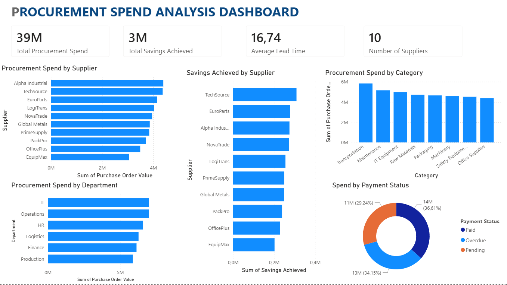

# Procurement Spend Analysis Dashboard

## Overview

This project showcases an interactive Power BI dashboard designed to analyze procurement performance and spending patterns across suppliers, departments, and purchasing categories.

The dashboard helps identify spending trends, supplier performance, savings opportunities, and procurement efficiency metrics through data visualization and business intelligence techniques.

## Dashboard Preview

## Key Performance Indicators (KPIs)

* Total Procurement Spend
* Total Savings Achieved
* Average Lead Time
* Number of Suppliers

## Dashboard Insights

### Procurement Spend by Supplier

Analyze procurement expenditure across suppliers and identify key spending partners.

### Procurement Spend by Category

Track spending across categories such as Raw Materials, IT Equipment, Packaging, Transportation, Machinery, and Office Supplies.

### Procurement Spend by Department

Compare purchasing activity across departments including Production, Logistics, Finance, HR, IT, and Operations.

### Savings Achieved by Supplier

Evaluate supplier contributions to procurement savings and cost optimization initiatives.

### Spend by Payment Status

Monitor procurement spending based on payment status:

* Paid
* Pending
* Overdue

## Tools & Technologies

* Power BI
* Microsoft Excel
* Data Visualization
* Procurement Analytics
* Business Intelligence

## Business Value

This dashboard demonstrates how procurement data can be transformed into actionable insights for:

* Cost reduction initiatives
* Supplier performance evaluation
* Procurement planning
* Lead time monitoring
* Spend management
* Decision-making support

## Author

**Fatima-Ezzahra Lasfar**

